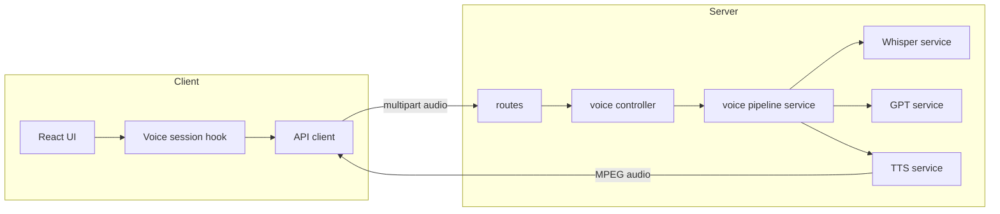

# MeshVoice AI

Voice-to-action AI assistant that captures voice input, transcribes with Whisper, generates responses with GPT, and plays spoken output using ElevenLabs.

## Features

- Voice recording in browser (MediaRecorder API)
- Whisper speech-to-text transcription
- GPT-based conversational response generation
- ElevenLabs text-to-speech audio playback
- Futuristic responsive UI with animated gradients
- Modular backend AI service architecture

## Tech Stack

- Frontend: React + Vite
- Backend: Node.js + Express
- AI APIs: OpenAI (Whisper + GPT), ElevenLabs (TTS)

## Setup

### 1) Install dependencies

```bash
npm install
```

### 2) Configure environment variables

Copy and populate:

- `server/.env.example` -> `server/.env`

Required variables:

- `OPENAI_API_KEY`
- `OPENAI_MODEL` (defaults to `gpt-4.1-mini`)
- `WHISPER_MODEL` (defaults to `whisper-1`)
- `ELEVENLABS_API_KEY`
- `ELEVENLABS_VOICE_ID`
- `PORT` (defaults to `5000`)
- `CLIENT_ORIGIN` (defaults to `http://localhost:5173`)

### 3) Run in development

```bash
npm run dev
```

- Frontend: `http://localhost:5173`
- Backend: `http://localhost:5000`

## Goal

This project demonstrates end-to-end voice AI orchestration:

- Speech capture
- Speech-to-text
- LLM response generation
- Text-to-speech synthesis
- Audio playback UX

## Mermaid diagram



